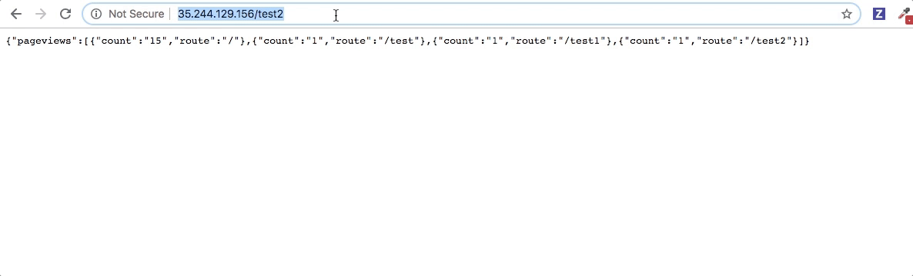

# hits-counter

NodeJS application, which shows the number of pageviews for the past 1 minute.

[](https://circleci.com/gh/amaksimov/hits-counter)

## Demo



## Live

[Try this magic app yourself](http://35.244.129.156)

## Requirements

- node v11.4.0+
- postgres 9.6+

## Getting started

```bash
npm install
nodemon index.js
```

## Docker

```bash
docker-compose build
docker-compose up -d app
```
